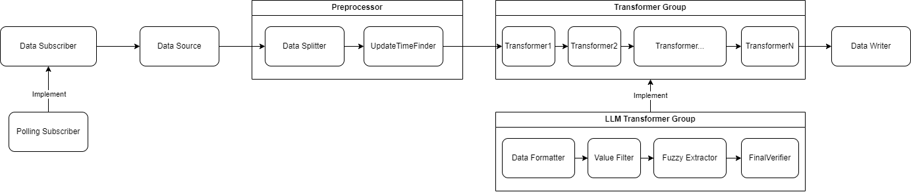

# Lite ETL
Lite ETL 是一个用于大数据领域开发的通用 ETL 框架。采用管道式设计，并配合 PreProcessor、Data Reader、Data Transformer、Data Writer 等组件，提供了高效、现代化的数据处理能力。
## 特性
- 轻量化设计：Lite ETL 专注于提供轻量级的 ETL 解决方案，避免了冗余的复杂性，使得使用者能够快速上手并集成到现有项目中。
- 管道式处理：采用管道式设计，数据处理过程更加清晰、模块化，易于理解和维护。
- 客制化：用户可以基于该框架自行实现相关组件，以完成对管道的功能扩展。
- 高效性：JavaPipe 使用了现代化的算法和优化技术，确保在处理大规模数据时能够保持高效率。
- 现代化架构：基于 Java 17 开发，充分利用了 Java 17 中的新特性，保持了与时俱进的现代化架构。
## 组件介绍

### Pre Processor
当订阅者从数据源获取到数据后，会优先将数据交给数据预处理器进行处理。
Lite ETL 默认提供了两种类型的数据预处理器：
- Data Splitter：将输入的文档按照一定规则拆分成若干个文档，以便于后续进行处理。
- Update Time Finder：更新时间查找者，指定一个能够获取到文档更新时间的规则，以便于在拉取数据时进行比对，差量更新。
### Subscriber
定义了从数据源获取数据的具体方式。
Lite ETL 默认提供了一种类型的数据订阅者：
- Polling Subscriber：按照一定的周期轮询订阅数据。
### Transformer
对数据进行详细处理或类型转换的组件，即为转换器。多个转换器按照特定顺序可组合为转换器组。按照组的规格应用至管道。
Lite ETL 默认提供了一种类型的转换器组：
- LLM Transformer Group：基于 LLM + Prompt 对数据进行处理，包含了 Data Formatter、Value Filter、Fuzzy Extractor、Final Verifier 四种转换器。
- Data Formatter：依据格式化字典，对输入数据进行规范化词典替换。
- Value Filter：判定数据对于特定领域的分析是否具有价值。
- Fuzzy Extractor：基于认知模型对数据进行模糊提取。
- Final Verifier：对数据进行最终校验，判断数据在转换过程中是否存在异常。
### Writer
对数据进行输出，用户可以自行定义多种类型的数据写入者，将数据以各种不同形式进行输出。
## 快速使用
```java
public class Example {
    public static void main(String[] args) {
        // 启用 LLM 模型能力
        ETLConfig.getInstance().enableLLM(
                "base-url",
                "sk-xxxxxx",
                ModelSource.OPEN_AI,
                "gpt-3.5-turbo"
        );
        // 规范化字典(可选)
        FormatDictionary dictionary = new FormatDictionary();
        // 管道对象
        Pipeline pipeline = Pipeline.builder()
                // 数据源
                .source(new TestSource())
                // 数据订阅者
                .subscriber(new PollingSubscriber())
                // 转换器组，包含一系列预先实现并按顺序绑定的转换器
                .transformerGroup(new LLMTransformerGroup(dictionary))
                // 数据写入者
                .writer(new ConsoleWriter())
                // 创建管道
                .build();
        // 开通管道，开始持续处理数据
        pipeline.open();
        // 关闭管道，不再接收并处理新的数据
        pipeline.close();
    }
}
```
## 依赖信息
```xml
前往 https://www.jitpack.io/#WolfLink-DevTeam/lite-etl 查看最新版本
<repositories>
    <repository>
        <id>jitpack.io</id>
        <url>https://www.jitpack.io</url>
    </repository>
</repositories>
<dependencies>
    <dependency>
        <groupId>com.github.WolfLink-DevTeam</groupId>
        <artifactId>lite-etl</artifactId>
        <version>Tag</version>
    </dependency>
</dependencies>
```
## 贡献
欢迎贡献者加入 Lite ETL 项目的开发和改进。如果你有兴趣为项目贡献代码、提交 bug 报告、改进文档或提出新的功能请求，请按照以下步骤进行：

点击 Fork 按钮，将仓库复制到你的 GitHub 账户中，再将 Fork 的仓库克隆到本地。
```sh
git clone https://github.com/your-username/lite-etl.git
cd lite-etl
```
接下来为你的修改创建一个新的分支。
```sh
git checkout -b feature-branch
```
请在本地分支上进行代码修改、bug 修复或文档改进，并提交你的修改到本地分支。
```sh
git add .
git commit -m "描述你的修改内容"
```
修改完成后将本地分支推送到你的 GitHub 仓库。
```sh
git push origin feature-branch
```
最后在 GitHub 上提交 Pull Request，请详细描述你的修改内容和目的。
在提交之前，请确保你的代码遵循项目的编码规范，并通过所有的测试。
## 许可证
Lite ETL 采用 MIT 许可证，详情请参阅以下内容：
```text
MIT License

Copyright (c) 2024 WolfLink-DevTeam

Permission is hereby granted, free of charge, to any person obtaining a copy
of this software and associated documentation files (the "Software"), to deal
in the Software without restriction, including without limitation the rights
to use, copy, modify, merge, publish, distribute, sublicense, and/or sell
copies of the Software, and to permit persons to whom the Software is
furnished to do so, subject to the following conditions:

The above copyright notice and this permission notice shall be included in all
copies or substantial portions of the Software.

THE SOFTWARE IS PROVIDED "AS IS", WITHOUT WARRANTY OF ANY KIND, EXPRESS OR
IMPLIED, INCLUDING BUT NOT LIMITED TO THE WARRANTIES OF MERCHANTABILITY,
FITNESS FOR A PARTICULAR PURPOSE AND NONINFRINGEMENT. IN NO EVENT SHALL THE
AUTHORS OR COPYRIGHT HOLDERS BE LIABLE FOR ANY CLAIM, DAMAGES OR OTHER
LIABILITY, WHETHER IN AN ACTION OF CONTRACT, TORT OR OTHERWISE, ARISING FROM,
OUT OF OR IN CONNECTION WITH THE SOFTWARE OR THE USE OR OTHER DEALINGS IN THE
SOFTWARE.
```
